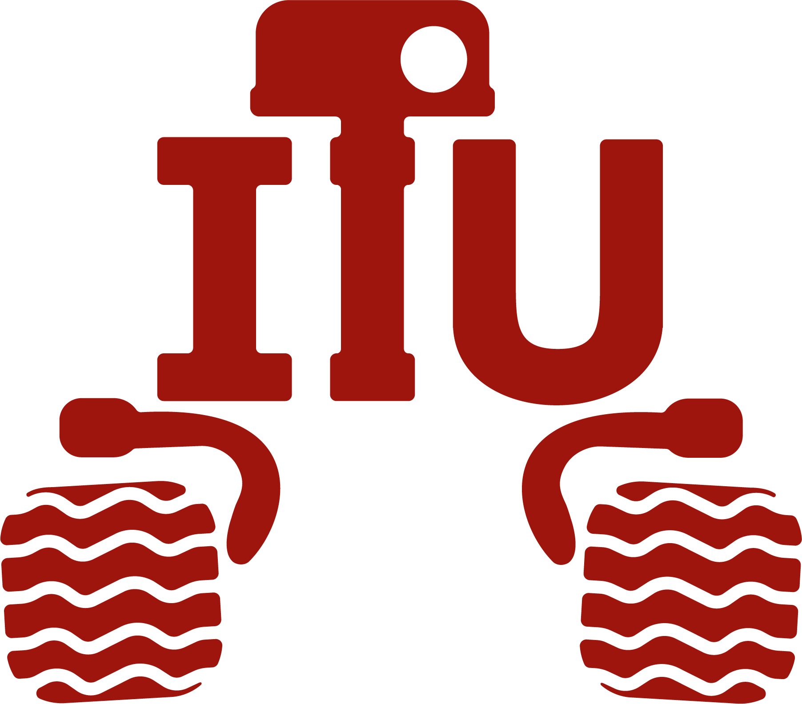

<div align="center">

</div>

**ITU Rover Görüntü İşleme Görevi**

Bu görevde, ROS kullanarak bir görüntü işleme node'u oluşturmanızı beklemekteyiz. Sizlere sunduğumuz `assignment.bag` dosyasında bulunan **/video_topic/compressed** topic'i üzerinden bir video yayını sağlanmıştır. Ayrıca başlatacağınız **'itu_rover_node'** her 2 saniyede bir bu yayına uygulanacak rastgele bir görüntü işleme tekniği **/filter** topic'i üzerinden yayınlanmaktadır.

Göreviniz, dinlediğiniz görüntü işleme tekniklerini video yayınına uygulamak ve sonucu 'rover_view/compressed' topic'i üzerinden yayınlamaktır.
# Kurulum

Ubuntu ve ROS kurulumunu da içeren ROS eğitimi: https://www.youtube.com/watch?v=asrw-iZdgz8

Yukarıdaki eğitimdeki Ubuntu ve ROS versiyonlarının farklı olduğuna dikkat ediniz.
Genel hatlarıyla benzer sistemler olsa da aşağıda belirttiğimiz versiyonları kurmanız
önemli.

### Ubuntu Kurulumu
Eğer Ubuntu 20.04 işletim sistemi kurulu bir bilgisayarınız varsa bu adımı atlayabilirsiniz.
İTÜ Rover takımında ROS Noetic dağıtımı kullanılıyor. Bu nedenle beraber çalışabilmemiz için
Ubuntu 20.04 yüklü bir sisteminiz olması gerekmektedir. Aşağıdaki linkten Windows işletim sistemini
silmeden Ubuntu 20.04 kurulumuyla ilgili bilgilere erişebilirsiniz.

https://www.linuxtechi.com/dual-boot-ubuntu-20-04-lts-along-with-windows-10/

### Linux Kullanımı

Aşağıdaki linkten temel Linux komutlarını öğrenip deneyebilirsiniz.

https://aktif.net/linux-komutlari/

### ROS Noetic Kurulumu
Aşağıdaki linkten öğrenerek Ubuntu’ya ROS Noetic kurulumunu tamamlayın.

http://wiki.ros.org/noetic/Installation/Ubuntu

### Paket Kurulumu

Bir workspace oluşturun.

```
mkdir ~/rover_ws
cd ~/rover_ws
catkin_init_workspace
mkdir src
```

Bu paketi klonlayıp derleyin.

```
cd ~/rover_ws/src
git clone https://github.com/itu-rover/iturover_processing_assignment
cd ..
catkin build
```

# Görev Adımları
Aşağıda adımları sırasıyla bulabilirsiniz:

1. ROSBAG dosyasını başlatın:
   ```
   roslaunch iturover_processing_assignment rosbag.launch 
   ```

2. Görüntü işleme komutlarını içeren scripti çalıştırın:
   ```
   rosrun iturover_processing_assignment filter_publisher.py
   ```

3. **/video_topic/compressed** topic'ine gelen [sensor_msgs/CompressedImage](http://docs.ros.org/en/noetic/api/sensor_msgs/html/msg/CompressedImage.html)  mesaj türündeki video akışını ve **/filter** topic'ine gelen [std_msgs/String](http://docs.ros.org/en/noetic/api/std_msgs/html/msg/String.html) komuları dinleyin.

4. Gelen görüntü işleme tekniklerini video akışına uygulayın.

   **GRAY**: Video akışını gri tonlamalı hale dönüştürür.
   
   **RGB**: Video akışını RGB tonlamalı hale dönüştürür.
   
   **RESIZE_UP**: Video akışının boyutunu iki katına çıkarır.
   
   **RESIZE_DOWN** :Video akışının boyutunu ikiye böler.
   
6. Elde edilen işlenmiş görüntüyü [sensor_msgs/CompressedImage](http://docs.ros.org/en/noetic/api/sensor_msgs/html/msg/CompressedImage.html) mesaj türünde **/rover_view/compressed** topic'ine yayınlayın.

Bu adımları takip ederek görevinizi tamamlayabilirsiniz. Başarılar dileriz!


https://github.com/itu-rover/iturover_processing_assignment/assets/99661459/57722f7b-8e00-47a1-9cb1-2acb91781dcc


# Ayrıca bakınız
* https://docs.opencv.org/
* http://wiki.ros.org/cv_bridge
